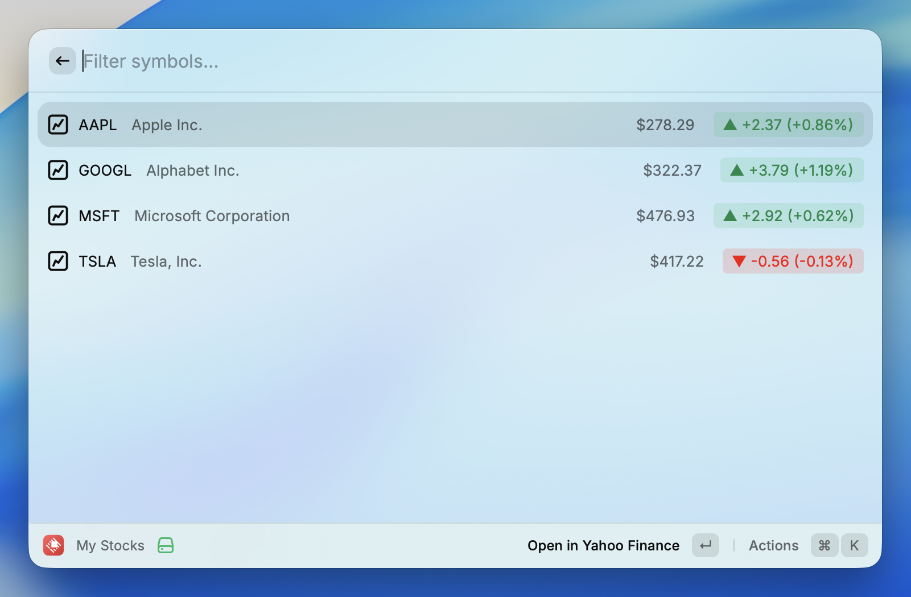

# My Stocks

A [Raycast](https://raycast.com) extension to track your stock watchlist at a glance.



## Why?

I wanted a fast way to check stock prices without opening a browser or app. Raycast is always a keystroke away, so it's the perfect place for a quick watchlist check.

## Features

- **Personal Watchlist** — Configure your own list of stock symbols
- **Live Prices** — Current price and daily % change from Yahoo Finance
- **Visual Cues** — Green/red icons for gains/losses
- **Detail Panel** — Toggle with `⌘D` to see day range, 52-week range, volume, market cap
- **Quick Actions** — Open in Yahoo Finance, copy symbol or price

## Installation

### From Raycast Store

🚧 Coming soon

### From Source

```bash
git clone https://github.com/igor-kupczynski/my-stocks.git
cd my-stocks
npm install
npm run dev
```

## Configuration

Open Raycast Settings → Extensions → My Stocks → **Stock Symbols**

Enter a comma-separated list of symbols:
```
AAPL, GOOGL, MSFT, ^GSPC, BTC-USD
```

Supports stocks, ETFs, indices (`^GSPC`), crypto (`BTC-USD`), and forex (`EURUSD=X`).

## Development

See [AGENTS.md](AGENTS.md) for development commands and architecture details.

```bash
npm run dev      # Start in Raycast with hot reload
npm test         # Run tests
npm run lint     # Check code style
```

### Pre-commit Hooks

This project uses [Husky](https://typicode.github.io/husky/) to automatically run checks before each commit:

- **Lint & auto-fix** all files
- **Build** the extension (TypeScript compilation)
- **Run tests** to catch breaking changes

Hooks are automatically set up when you run `npm install`. If you need to bypass the hook (not recommended), use `git commit --no-verify`.

## License

[MIT](LICENSE) © 2025 Igor Kupczyński
